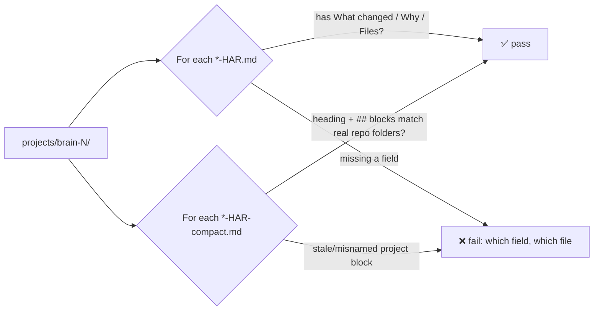

# Contributing to Harness Brain

Thanks for considering a contribution — welcome! This is a plain-Markdown
repo, so contributing doesn't require any programming — just careful reading
and following the existing format.

## Ways to contribute

- **Add a worked example.** The most valuable thing you can add is a new
  scenario under `projects/` that isn't already covered — e.g. a monorepo, a
  three-repo product, a repo that later gets folded into an existing brain.
  Follow the shape of the existing examples (`projects/brain-1/` for
  "related repos", `projects/brain-2/` or `projects/brain-3/` for "unrelated").
- **Fix or clarify the docs** — `README.md`, or the entry-format templates in
  `_templates/`.
- **Report confusion.** If you tried to set this up and got stuck, that's a
  useful issue on its own — [open one](https://github.com/cloudbloqavi/harness-brain/issues).
- **Improve the writer/reader agents** — `commit-brain-agent` and
  `cross-repo-discovery-agent` are implemented in the
  [harness-stack](https://github.com/cloudbloqavi/harness-stack) repo, not
  here; contributions to their behaviour belong there.

## Setup

No build step, no dependencies — it's Markdown:

```bash
git clone https://github.com/cloudbloqavi/harness-brain.git
cd harness-brain
```

Before opening a PR that touches `projects/`, check your entry is well-formed
with the validation script (plain Node, no install needed — works the same on
Linux, macOS, and Windows as long as you have
[Node.js](https://nodejs.org) 18+ on your `PATH`):

```bash
npm run validate
```

It checks that every detailed log has the required `What changed` / `Why` /
`Files` fields **with real content** (not blank, not a leftover "TBD"), that
every commit heading starts with a real-looking short SHA, that every
`YY-MM-DD` date is an actual calendar date, and that every compact rollup's
`## <project>` blocks match real repo folders **in both directions** — a
stale block with no matching folder, and a folder with no block, are both
flagged. CI runs the same script on every PR, on Linux, macOS, and Windows.

If you change `scripts/validate-entries.mjs` itself, run its unit tests too:

```bash
npm test
```



## The rules every file in this repo follows

Keep new content consistent with these, so the templates and the agents that
read/write them keep working:

1. **All dates are fully numeric**, `YY-MM-DD` (e.g. `26-07-03` for
   2026-07-03) — never month names, never `MM-DD-YY`.
2. **One brain per group of related repos.** A brain is a folder
   `projects/brain-<n>/`. Repos that belong to the same product/team/deploy
   unit share a brain; unrelated repos each get a new, unused number.
3. **One folder per repo inside its brain**, named after the repo:
   `projects/brain-<n>/<repo-name>/`.
4. **Detailed logs are per-repo, per-day**: `<repo>/<YY-MM-DD>-HAR.md`. Follow
   [`_templates/YY-MM-DD-HAR.md`](_templates/YY-MM-DD-HAR.md) — what changed,
   why, files touched, cross-repo impact, flags.
5. **Exactly one compact rollup per brain**, at the brain's root:
   `<brain>/<YY-MM-DD>-HAR-compact.md`, one short block per repo in that brain.
   Follow [`_templates/YY-MM-DD-HAR-compact.md`](_templates/YY-MM-DD-HAR-compact.md),
   including its heading shape: `<brain> (<product-or-repo-name>) —
   compact — <YY-MM-DD>`, e.g. `brain-1 (Ledger) — compact — 26-06-07`.
6. **Every brain and every repo folder has a `README.md`** — a short index,
   not a copy of the detailed log.

If you're adding a new worked example, copy the shape of
[`projects/brain-1/`](projects/brain-1) (related repos) or
[`projects/brain-2/`](projects/brain-2) (unrelated repo) as your template, and
use clearly **fictional** project/company names and commit hashes.

## Keeping harness-stack in sync

[harness-stack](https://github.com/cloudbloqavi/harness-stack) ships an
offline copy of this repo's `README.md`, `_templates/`, and `projects/` under
`templates/brain/`, and its CI enforces that the two stay **byte-identical**
(`npm run verify:brain-template` there). If your PR here changes any of those
three, please also open a matching PR on harness-stack copying the same files
into `templates/brain/` — otherwise that CI check will fail once both repos'
`main` branches are compared. A pure docs typo fix that doesn't touch
`README.md`/`_templates/`/`projects/` doesn't need a companion PR.

## Commit & PR style

- Short, clear commit messages.
- One concern per PR — a new example and a doc fix are two PRs, not one.
- Say in the PR description what you added/changed and why.
- Drafts are welcome if you want early feedback before finishing.

## Questions

Open a [GitHub issue](https://github.com/cloudbloqavi/harness-brain/issues) —
no question is too small.
